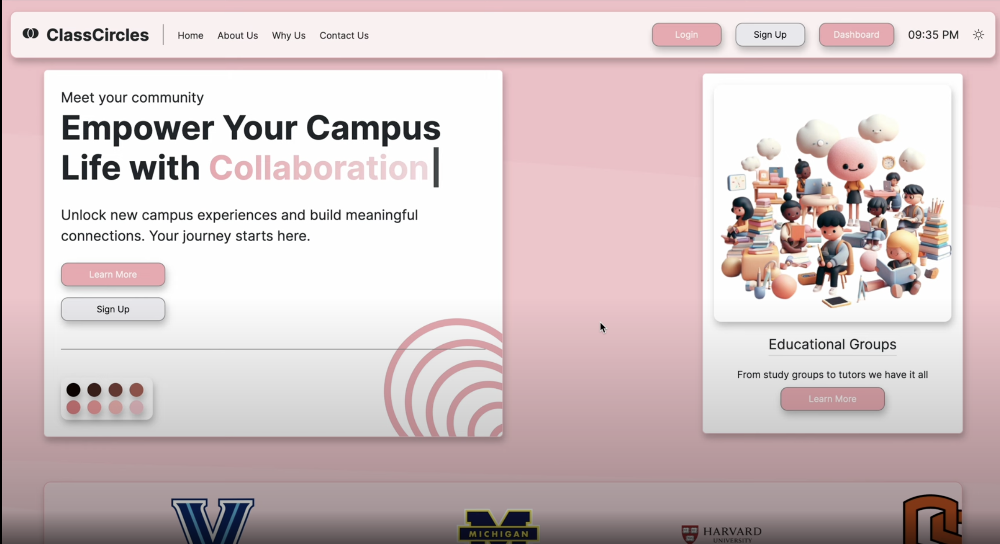

# ClassCircles: The Campus Connection You've Been Waiting For

## The Catalyst

We were students scattered in different time zones, frustrated by disconnected campus lives. This wasn't just our problem; it was a universal struggle. Having been in school during the pandemic we know how difficult it was to make meaningful connection and we felt like we had been robbed from that experience. That sparked the idea for ClassCircles—a one-stop platform to make campus community discovery a breeze.

## The Learnings
**Frontend:**
- React
- Bootstrap
- Vanilla css
- framer motion (animations)
- chart.js (data visuialization)
- email.js (contact form)
- MUI.js (react ui library)
- vite
- react-router

**Backend:**
- Node.js
- Express.js
- MongoDB
- Mongoose (ODM)
- Passport local-session (auth)
- Postman (testing)

**Cloud:**
- AWS (backend)
- Netlify (Frontend) -> Note this deployment uses dummy data as will be explained why below. Its a few versions behind main so some assets may be different.

## Features
Students can then register for an account or sign in to an existing one. 
Once users are logged in they can perform the following: 
1) Send an email to the group members in their various groups
2) Edit their personal information
3) Join both educational and recreational groups
4) Create both educational and recreational groups   

These are the basic features of our MVP, we believe integrating a real-time chat api like song bird however that was not possible for us given the time constraints. 
